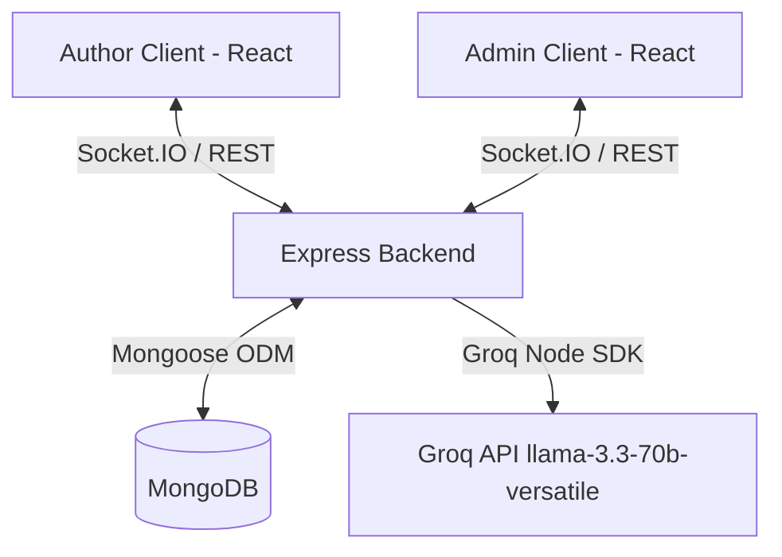

# BookLeaf Publishing - Author Support & Communication Portal

An intelligent full-stack MERN application (MongoDB, Express, React, Node) built to streamline communication between authors and the BookLeaf operations team. The portal features automated AI-powered support ticket classification, automatic priority routing, real-time message synchronization, and private operations logging.

---

## 🚀 Quick Start & Setup

### Prerequisites
- [Node.js](https://nodejs.org/) (v16+ recommended)
- [MongoDB](https://www.mongodb.com/) (running locally or via Atlas)
- [Groq API Key](https://console.groq.com/) (Optional; for AI classification and auto-drafts. The system gracefully degrades if not supplied).

### Installation

1. **Clone & Explore Workspace**:
   Ensure you are in the workspace root directory: `c:\Users\sonus\Documents\bookleaf-assignment`.

2. **Database Seeding**:
   Open a terminal and run these commands to seed the catalog with ~10 authors, ~18 books, and 2 default operations managers:
   ```bash
   cd backend
   npm install
   npm run seed
   ```
   *Note: All seeded passwords are `bookleaf123`.*

3. **Start the Backend Server**:
   Duplicate or rename the backend configuration:
   ```bash
   cp .env.example .env
   ```
   Provide your `GROQ_API_KEY` (if available) in `.env` and start the server:
   ```bash
   npm run dev
   ```
   The backend server binds locally to `http://localhost:5000`.

4. **Start the Frontend Portal**:
   Open another terminal tab and launch the React development server:
   ```bash
   cd ../frontend
   npm install
   cp .env.example .env
   npm run dev
   ```
   Open your browser at `http://localhost:5173`.

---

## 👥 Demo Logins (Password: `bookleaf123`)

| Portal | Role | Name | Email |
| :--- | :--- | :--- | :--- |
| **Author** | Author | Anika Desai | `anika.desai@email.com` |
| **Author** | Author | Vikram Joshi | `vikram.joshi@email.com` |
| **Author** | Author | Arjun Malhotra | `arjun.malhotra@email.com` |
| **Operations** | Admin | Priya Sharma | `priya.sharma@bookleaf.in` |
| **Operations** | Admin | Rahul Mehta | `rahul.mehta@bookleaf.in` |

---

## 🏗️ Architecture & Tech Stack

The application employs a decoupled MERN architecture with real-time sockets:



### Key Technical Details
- **Decoupled Security**: Clean Separation of Concerns. Author accounts can only read, write, or query **their own** books, tickets, and messages. Admins possess full dashboard queues with override privileges.
- **Real-Time Engine**: Built on Socket.IO. Handshake verifies JWT. Author replies auto-reopen threads, admin replies auto-update client states, and queue modifications (status, priority) propagate instantly without page reload.
- **Dedicated AI Service**: Built using Groq Node SDK. Auto-classifies tickets upon submission and generates context-aware, highly polite drafts based on live financial ledgers and BookLeaf operational policy.

---

## 🧠 AI Service & Prompt Engineering

The system integrates a dedicated, production-ready `AIService` (`backend/src/services/aiService.js`) designed for cost-efficiency, low-latency, and high reliability:

1. **Model Selection**: Uses `llama-3.3-70b-versatile` via Groq environment variables. This model provides extremely fast response speeds, exceptional text classification accuracy, and high cost efficiency.
2. **Ticket Classification**:
   - **Trigger**: When an author submits a new ticket, the subject and description are parsed.
   - **System Instruction**: Enforces JSON-only response formats, specifying the 6 allowed support categories and 4 priority tiers (with exact rules, such as mapping "missing royalties for 6 months" to High/Critical).
   - **Confidence Metric**: The model outputs numerical confidence ratings (0.0 to 1.0) which are stored in the database for admin analytics.
3. **Draft Response Engine**:
   - **Policy Injection**: Injects the full `BOOKLEAF_KNOWLEDGE_BASE` policy (including quarterly schedules, trim sizing, 70 GSM Cream paper natural shades, distribution availability, and manufacturing replacements).
   - **Empathetic Guidelines**: Enforces specific communication tone rules (always greeting authors by name, owning BookLeaf mistakes directly, apologizing without deflection, providing concrete timelines, and concluding with next actions).
   - **Token Efficiency**: Instead of sending full user histories or massive raw database dumps, it passes a compiled compact text summary of the book's current financials, production stage, and only the *last 3* messages in the conversation.
4. **Graceful Degradation**: If no API key is specified, or if Groq is down (5xx errors or network timeouts), the service catches the error:
   - Sets ticket classification to `'General Inquiry'` and priority to `'Medium'` with `0.5` confidence using local heuristics.
   - Returns a helpful notice in the admin draft textarea ("AI drafts are currently offline, write reply manually").
   - **Critical Rule**: Ticket creation, updates, and messaging are NEVER blocked by AI outages.

---

## 🛜 REST API Reference

The server exposes a clean JSON REST API under `/api`.

### Error Responses
All endpoints use standard HTTP status codes:
- **400 Bad Request**: Returns `{ "error": "ValidationError", "details": [{ "field": "email", "message": "..." }] }`
- **401 Unauthorized**: Returns `{ "error": "Unauthorized", "message": "No authentication token provided" }`
- **403 Forbidden**: Returns `{ "error": "Forbidden", "message": "Role 'author' is not authorized to access this resource" }`
- **404 Not Found**: Returns `{ "error": "NotFound", "message": "Ticket not found" }`

---

### Authentication

#### `POST /api/auth/login`
- **Auth Requirement**: None
- **Body Parameters**:
  - `email` (string, required) - Valid email address.
  - `password` (string, required) - The plain text password.
- **Example Response (`200 OK`)**:
  ```json
  {
    "token": "eyJhbGciOiJIUzI1NiIsInR5cCI6IkpXVCJ9...",
    "user": {
      "id": "65b2f8a1c8c5b9631a88b801",
      "name": "Anika Desai",
      "email": "anika.desai@email.com",
      "role": "author"
    }
  }
  ```

#### `GET /api/auth/me`
- **Auth Requirement**: Bearer JWT (Author or Admin)
- **Example Response (`200 OK`)**:
  ```json
  {
    "user": {
      "id": "65b2f8a1c8c5b9631a88b801",
      "name": "Anika Desai",
      "email": "anika.desai@email.com",
      "role": "author"
    }
  }
  ```

---

### Author Endpoints (Requires `role=author` JWT)

#### `GET /api/authors/me/books`
- **Auth Requirement**: Bearer JWT (Author)
- **Example Response (`200 OK`)**:
  ```json
  [
    {
      "_id": "65b2f8a1c8c5b9631a88b810",
      "authorId": "65b2f8a1c8c5b9631a88b801",
      "title": "Whispers of the Ganges",
      "isbn": "978-93-51234-01-1",
      "genre": "Literary Fiction",
      "publicationDate": "2023-06-15T00:00:00.000Z",
      "status": "Published",
      "mrp": 399,
      "totalCopiesSold": 4520,
      "totalRoyaltyEarned": 135600,
      "royaltyPaid": 108480,
      "royaltyPending": 27120,
      "distributionPlatforms": ["Amazon IN", "Amazon US", "Flipkart", "BookLeaf Store"],
      "productionStage": "Published & Live"
    }
  ]
  ```

#### `GET /api/authors/me/tickets`
- **Auth Requirement**: Bearer JWT (Author)
- **Example Response (`200 OK`)**:
  ```json
  [
    {
      "_id": "65b2f8a1c8c5b9631a88b820",
      "authorId": "65b2f8a1c8c5b9631a88b801",
      "bookId": {
        "_id": "65b2f8a1c8c5b9631a88b810",
        "title": "Whispers of the Ganges",
        "isbn": "978-93-51234-01-1",
        "status": "Published"
      },
      "subject": "Royalty payout delay",
      "description": "My pending royalties are not yet paid.",
      "status": "Open",
      "category": "Royalty & Payments",
      "priority": "High",
      "messages": [
        {
          "senderType": "author",
          "senderId": "65b2f8a1c8c5b9631a88b801",
          "body": "My pending royalties are not yet paid.",
          "createdAt": "2026-05-19T13:00:00.000Z"
        }
      ],
      "createdAt": "2026-05-19T13:00:00.000Z",
      "updatedAt": "2026-05-19T13:00:00.000Z"
    }
  ]
  ```

#### `GET /api/authors/me/tickets/:id`
- **Auth Requirement**: Bearer JWT (Author, ticket owner only)
- **Example Response (`200 OK`)**: Same schema as `GET /api/authors/me/tickets` but returns a single object containing detailed linked book metadata.

#### `POST /api/authors/me/tickets`
- **Auth Requirement**: Bearer JWT (Author)
- **Body Parameters**:
  - `subject` (string, required) - Short ticket summary.
  - `description` (string, required) - Detailed explanation of the issue.
  - `bookId` (string, optional) - Associated book ID, or "general" / empty.
- **Example Response (`201 Created`)**: Returns the newly created, AI-classified Ticket object.

#### `PATCH /api/authors/me/tickets/:id`
- **Auth Requirement**: Bearer JWT (Author, ticket owner only)
- **Body Parameters**:
  - `messageBody` (string, optional) - Message reply. Automatically reopens ticket to "In Progress".
  - `status` (string, optional) - Set to `"Closed"` to close ticket.
- **Example Response (`200 OK`)**: Returns the updated Ticket object.

---

### Admin Endpoints (Requires `role=admin` JWT)

#### `GET /api/admin/tickets`
- **Auth Requirement**: Bearer JWT (Admin)
- **Query Parameters**:
  - `status` (string, optional) - Filter by Open, In Progress, Resolved, or Closed.
  - `category` (string, optional) - Filter by one of the 6 triage categories.
  - `priority` (string, optional) - Filter by Critical, High, Medium, or Low.
  - `fromDate` (string, optional) - ISO8601 date.
  - `toDate` (string, optional) - ISO8601 date.
- **Example Response (`200 OK`)**:
  ```json
  [
    {
      "_id": "65b2f8a1c8c5b9631a88b820",
      "authorId": { "_id": "65b2f8a1c8c5b9631a88b801", "name": "Anika Desai", "email": "anika.desai@email.com" },
      "bookId": { "_id": "65b2f8a1c8c5b9631a88b810", "title": "Whispers of the Ganges", "status": "Published" },
      "subject": "Royalty payout delay",
      "status": "Open",
      "category": "Royalty & Payments",
      "priority": "High",
      "createdAt": "2026-05-19T13:00:00.000Z",
      "updatedAt": "2026-05-19T13:00:00.000Z"
    }
  ]
  ```

#### `GET /api/admin/tickets/:id`
- **Auth Requirement**: Bearer JWT (Admin)
- **Example Response (`200 OK`)**: Returns the Ticket details containing the full conversation history, private `internalNotes`, and detailed book financial context.

#### `PATCH /api/admin/tickets/:id`
- **Auth Requirement**: Bearer JWT (Admin)
- **Body Parameters**:
  - `status` (string, optional) - Open / In Progress / Resolved / Closed
  - `category` (string, optional) - Triage category override.
  - `priority` (string, optional) - Priority level override.
  - `assignedToAdminId` (string/null, optional) - Admin user ID to assign or `null` to unassign.
- **Example Response (`200 OK`)**: Returns the updated Ticket object.

#### `POST /api/admin/tickets/:id/reply`
- **Auth Requirement**: Bearer JWT (Admin)
- **Body Parameters**:
  - `messageBody` (string, required) - Support response body.
- **Example Response (`200 OK`)**: Returns the updated Ticket object.

#### `POST /api/admin/tickets/:id/notes`
- **Auth Requirement**: Bearer JWT (Admin)
- **Body Parameters**:
  - `note` (string, required) - Private operational annotations (hidden from authors).
- **Example Response (`201 Created`)**: Returns the updated Ticket object with the new note appended.

#### `POST /api/admin/tickets/:id/ai-draft`
- **Auth Requirement**: Bearer JWT (Admin)
- **Example Response (`200 OK`)**:
  ```json
  {
    "success": true,
    "draft": "Dear Anika,\n\nThank you for reaching out regarding your royalty delay..."
  }
  ```

---

## 🚧 Key Design Decisions & Future Scope

### Implementation Decisions
- **Decoupled native fetch API client**: Standardizing on the browser's fetch API with custom interceptors to keep packages small.
- **Private Notes Isolation**: Stored in a separate schema subdocument, returned only via `/api/admin` endpoints to ensure no author can ever see internal staff annotations.
- **Embedded Messages**: Keeps DB reads simple by embedding ticket messages inside the parent ticket collection, ensuring atomic operations when replying.

### Future Enhancements
- **Multi-file Upload S3 Integration**: Standardize file uploads to Amazon S3.
- **Full Text Search**: Add Elasticsearch or Atlas Search to let admins search tickets by description keywords.
- **Analytics Dashboards**: Provide real-time charts (using Recharts or Chart.js) mapping average ticket resolution age, category frequencies, and AI classification success rates.
